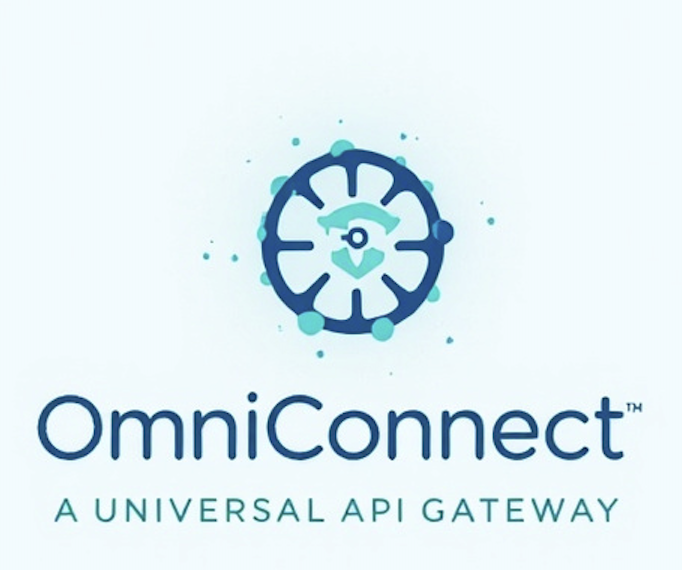

# OminiConnect



**Give your AI agents and LLM applications real API superpowers.**

OminiConnect is a platform — deploy it **self-hosted** on your own infrastructure, or in the **cloud** (Docker, Kubernetes coming soon) — that lets AI agents interact with external services like GitHub, Slack, Salesforce, Feishu, DingTalk, and 700+ more. It handles OAuth, stores tokens, enforces scopes, and gives AI agents a clean tool interface instead of raw API keys.

---

## What you can do with it

**Connect accounts once, use them forever.**
Connect GitHub, LinkedIn, Salesforce, and other platforms via OAuth. Tokens are stored securely and refreshed automatically. No more "the user revoked my token" errors.

**Give AI agents tools, not API keys.**
Agents get a bounded set of tools (`list_repos`, `send_message`, `create_contact`) scoped to what the connected account can actually do. Agents can't read your emails or post to pages you didn't authorize.

**Build agentic workflows that actually work.**
Agents can call `POST /api/tools/execute` with natural-language-friendly arguments. Every call is logged. Long-running tasks can POST results back to your webhook. Agents connect via MCP (Model Context Protocol) for discovery and streaming.

**Use it with any AI framework.**
Python or JS SDKs for the portal API. MCP endpoint for native MCP clients (Claude Desktop, Cursor, etc.). REST proxy for simple API passthrough.

---

## Quick start

### 1. Run the portal

```bash
git clone --recurse-submodules <your-repo>
cd OminiConnect
cp .env.example .env
cargo run -p omini-connect-portal
```

Open **http://localhost:9000** and create an account.

### 2. Connect a platform

In the UI, go to **Connectors** → pick a platform (GitHub, LinkedIn, etc.) → authorize via OAuth. The token is stored and refreshed automatically.

### 3. Give an AI agent access

```python
from ominiconnect import OminiConnect

client = OminiConnect(api_key="your-portal-api-key")

# Register an agent — get a dedicated API key for the agent
agent = client.agents.register(name="github-writer")
print(agent["api_key"])  # store securely — shown only once

# Agent uses this key to call tools
agent_client = OminiConnect(api_key=agent["api_key"])
tools = agent_client.tools.list(platform="github")
result = agent_client.tools.execute(
    "github_list_repos",
    arguments={"sort": "updated"}
)
```

Or use MCP directly — any MCP-compatible AI client can discover and call tools through OminiConnect without any code changes.

---

## Supported platforms

**International:** GitHub, LinkedIn, Facebook, X/Twitter, Google, Salesforce, HubSpot, Jira, Confluence, Slack, Notion, Stripe, Shopify, GitLab, Zoom, and 700+ more via Nango.

**China (中国):** Feishu (飞书), DingTalk (钉钉), WeChat Work (企业微信), QQ Enterprise Mail (QQ邮箱), and more — with domestic OAuth and API integrations optimized for China deployments.

---

## How it fits into your application

```
Your AI Agent
    │  Bearer <agent-api-key>
    ▼
OminiConnect portal  ──── OAuth token ────► GitHub / Slack / etc.
    │                                          ▲
    │  tools/list  (MCP or REST)               │
    │  tools/call                               │
    │  proxy/{platform}/*                       │
    ▼                                           │
Your application  ◄──── webhook / SSE ──────────┘
```

### Scenario 1: AI coding assistant

Connect your GitHub org once. Agents can list repos, create issues, write PR descriptions — but can't access repos outside your org or post to accounts they weren't given scope for.

### Scenario 2: AI social media manager

Connect LinkedIn and Facebook pages. Agents can read page analytics and post content — scoped to the pages you authorized. No ability to post to personal profiles or other companies.

### Scenario 3: AI sales assistant

Connect Salesforce and HubSpot. Agents can look up contacts, update CRM records, trigger workflows — with full audit logs for compliance.

### Scenario 4: Enterprise productivity (China)

Connect Feishu, DingTalk, or WeChat Work. Agents help employees query internal tools, send messages, schedule meetings — with IT-managed scopes and scopes enforced per tool call.

---

## API overview

| Method | Path | What it does |
|--------|------|--------------|
| `POST` | `/api/agents` | Register an agent, get its API key |
| `GET` | `/api/tools` | List available tools for a platform |
| `GET` | `/api/tools/search` | Search tools by name or description |
| `POST` | `/api/tools/execute` | Execute a tool (sync or async via `callback_url`) |
| `POST` | `/api/mcp` | MCP JSON-RPC — `tools/list`, `tools/call` |
| `GET` | `/api/mcp/sse` | SSE stream for async push to MCP clients |
| `POST` | `/api/proxy/{platform}/*` | Passthrough to vendor API with stored token |

Full API reference: see `docs/API.md` (coming soon).

---

## SDKs

- **Python**: `pip install ominiconnect` — `from ominiconnect import OminiConnect`
- **JS/TS**: `npm install @ominiconnect/sdk` — `OminiConnectClient`

See `sdk/README.md` for full usage.

---

## Security

- OAuth tokens and API keys are stored **hashed** — plaintext tokens are never returned.
- Each agent gets its own scoped API key — no shared credentials.
- Scopes are enforced per tool call — agents can only perform actions within authorized scopes.
- All tool calls are **audited** with timestamp, duration, and response body.

---

## Deploying

OminiConnect is a Rust + React application.

- **Self-hosted**: Run on your own VMs or bare metal with Docker or directly via `cargo run`.
- **Cloud**: Docker images and Kubernetes Helm charts coming soon.
- **Database**: Postgres (recommended) or SQLite for tokens, API keys, and audit logs.
- **Public URL**: Set `PORTAL_BASE_URL` to your public domain for OAuth callbacks.
- **Optional**: Self-hosted Nango for 700+ additional platforms.

See `.env.example` for all configuration options.

---

## License

Private — All rights reserved.
